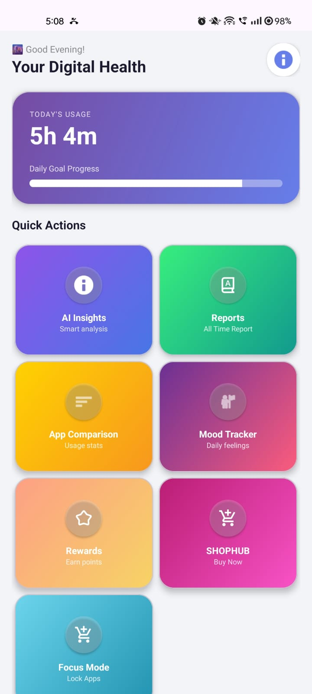
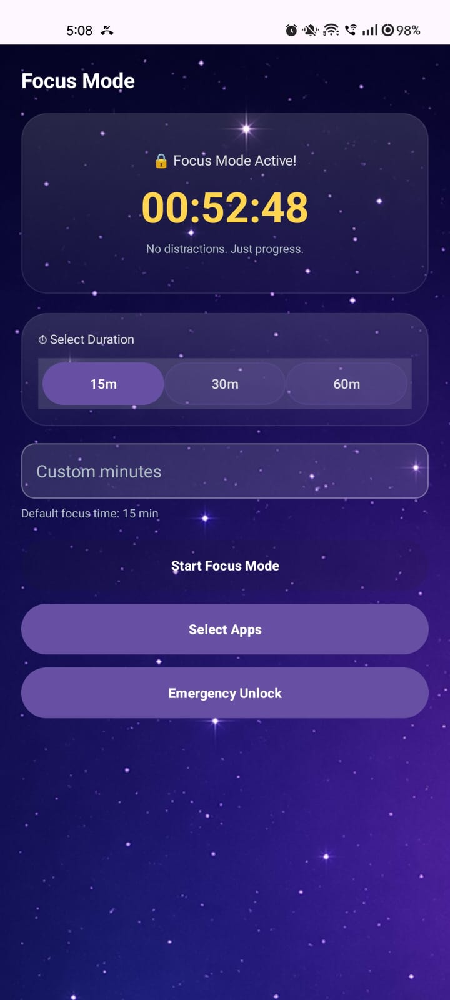
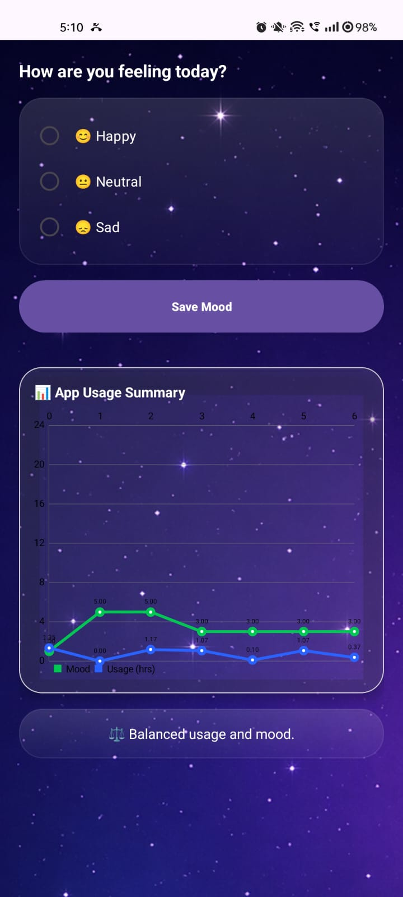
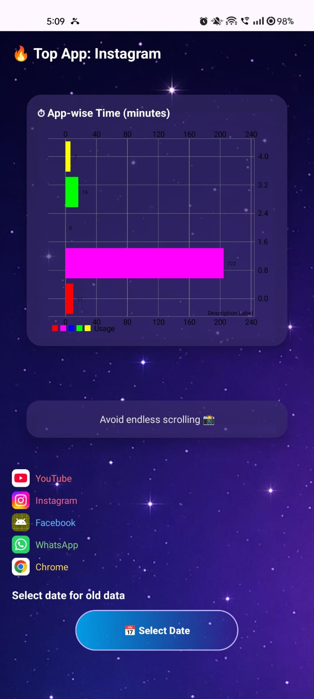
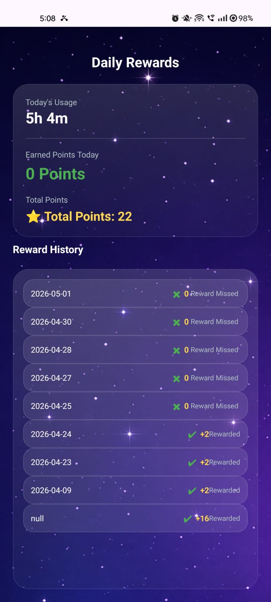
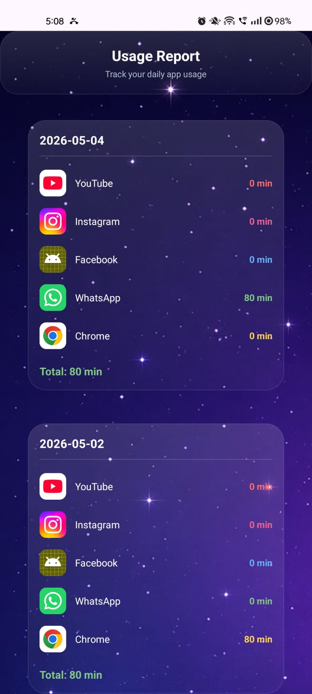

# 📱 Social Media Addiction Tracker

> An Android application that monitors smartphone usage and helps users reduce social media addiction through screen time tracking, focus mode, mood tracking, AI chatbot assistance, and reward-based motivation.

<p align="center">
  
  
  
  
</p>

---

# 📖 About the Project

Social Media Addiction Tracker is an Android application developed as a **Final Year Engineering Project**. The application helps users understand their smartphone usage patterns, monitor social media activity, improve productivity, and build healthier digital habits using intelligent tracking and motivational features.

---

# ✨ Features

- 📊 Screen Time Tracking
- 📱 App Usage Monitoring
- 🎯 Focus Mode
- 😊 Mood Tracker
- 🤖 AI Chatbot
- 🏆 Reward System
- 📈 Daily & Weekly Reports
- 📊 Usage Comparison
- 🔒 App Selection
- 💾 SQLite Database
- 📲 Simple & User-Friendly Interface

---

# 🛠️ Tech Stack

| Technology | Description |
|------------|-------------|
| Java | Application Logic |
| XML | User Interface |
| Android Studio | Development Environment |
| SQLite | Local Database |
| UsageStatsManager API | Usage Tracking |
| Gemini API | AI Chatbot |

---

# 📂 Project Structure

```text
SocialMediaAddictionTracker
│
├── app/
├── gradle/
├── screenshots/
├── README.md
├── build.gradle
├── settings.gradle
├── gradlew
└── gradlew.bat
```

---

# 🚀 Installation

### Clone Repository

```bash
git clone https://github.com/Anand8595/SocialMediaAddictionTracker.git
```

### Open in Android Studio

1. Open Android Studio.
2. Click **Open Existing Project**.
3. Select the cloned project.
4. Wait for Gradle Sync.
5. Connect an Android device or Emulator.
6. Run the application.

---

# 📦 APK

You can download the application from:

[📥 Download APK](apk/socialmedia.apk)

---

# 📸 Application Screenshots

## 🏠 Home Screen

<p align="center">
  
</p>

---

## 🎯 Focus Mode

<p align="center">
  
</p>

---

## 😊 Mood Tracker

<p align="center">
  
</p>

---

## 📊 Digital Insights

<p align="center">
  
</p>

---

## 🏆 Rewards

<p align="center">
  
</p>

---

## 📈 Usage Report

<p align="center">
  
</p>

---

## 🛒 Shopping Website

<p align="center">
  
</p>

---

# 🎯 Future Enhancements

- Cloud Backup
- Firebase Authentication
- Push Notifications
- Advanced AI Recommendations
- Dark Mode
- Multi-language Support

---

# 🎓 Academic Information

**Project Title**

Social Media Addiction Tracker

**Project Type**

Final Year Engineering Project

---

# 👨‍💻 Author

**Anand Ahire**

🎓 Bachelor of Engineering (Computer Engineering)

💻 MERN Stack Developer | Android Developer

### Connect with Me

- GitHub: https://github.com/Anand8595
- LinkedIn: https://www.linkedin.com/in/anand-ahire-142519307

---

# 📄 License

This project was developed for educational and academic purposes as part of a Final Year Engineering Project.
---


---

# ⭐ Support

If you found this project helpful, please consider giving it a ⭐ on GitHub.

Made with ❤️ by **Anand Ahire**
